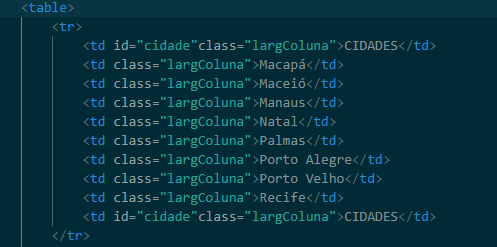
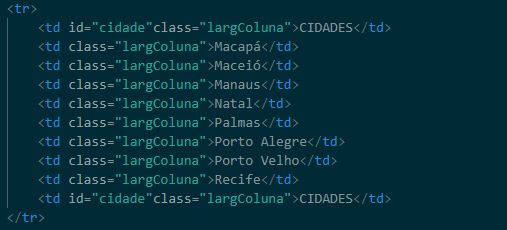
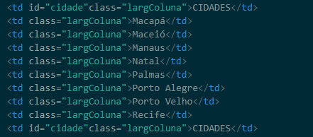
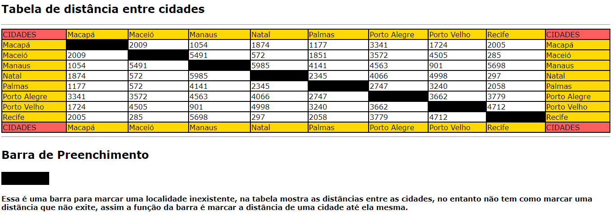

# Projeto - Tabela - Distancia
 
Projeto criado como parte avaliativa da disciplina de Fundamentos de Desenvolvimento ministrada pelo professor Leonardo Rocha.
 
## Índice
* [Descrição](#descrição)
* [Tecnologias](#tecnologias)
* [Referências](#referências)
* [Autor(a)](#autora)
 
### Descrição
 
O Projeto consite na composição de uma tabela que conta com capitais brasileiras e distância entre essas capitais. As capitais constantes nesse projetos são:

* Maceió
* Macapá
* Manaus
* Natal
* Palmas
* Porto Alegre
* Porto Velho
* Recife


### Tabela

* table - é um conjunto estruturado de dados composto de linhas e colunas (dados tabulares).

* tr - a tag tr cria uma linha dentro de uma tag table e acomoda diversas tags th ou td que criam colunas dentro das linhas, formando uma tabela no documento

* td - a tag td cria uma coluna para inserção de conteúdos, junto a diversas outras colunas em uma mesma linha definida pela tag tr
 
Veja uma imagem de parte do codígo, onde é possivel indentificar o uso dos elementos mencionados acima:

 * table
 

 
* tr
 

 
* td
 


### Resultado Final do Projeto



### Estilização

O projeto foi estilizado, utilizando CSS3. Foi criado um arquivo chamado main.css. Nesse arquivo, constam configurações de estilo apresentados a seguir:

* Estilo de cores - A cor de fundo utilizada no projeto foi definida como segue:

```

.largColuna{
    width: 200px;
    background-color:rgb(255, 217, 5);
}

```


 
## Tecnologias

* HTML5
* CSS3
* Git
* Github
 
## Referências
 
[Alura](https://www.alura.com.br/artigos/escrever-bom-readme) - Como escrever um README incrivel no seu gitHub

## Autor(a)

Projeto desenvolvido pelo seguintes participantes:

* Vitor Eduardo
* Caio Lovison
* Miguel Gonçalves
* Kiara Messias
* Rafaela Araújo
* Isabella Fontana
